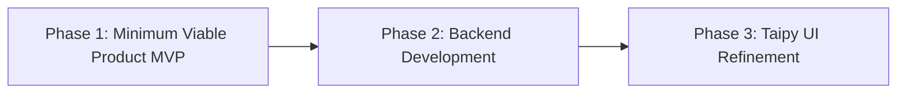

# Developer Documentation for MultiverseNote

## Project Roadmap

Welcome to the MultiverseNote Developer Documentation. This document outlines the roadmap for the project, detailing stages and key milestones that will guide our development from inception to full release.

## Overview

MultiverseNote aims to transform AI chatbot interactions into structured project management workflows. The development is structured into several key phases, each building upon the previous one to gradually increase functionality and user engagement.

## Phase 1: Minimum Viable Product (MVP)

**Objective**: Establish basic functionality using Taipy to handle simple project management tasks and branching dialogues.

- **System Design**: Develop the initial user interface using Taipy, integrating both UI and backend functionality.
- **Core Features**: User authentication, project creation, and simple branching mechanics.
- **Timeline**: Q3 2024

## Phase 2: Backend Development

**Objective**: Develop a comprehensive backend system to support extensive project management features.

- **Database Integration**: Set up a robust database system to manage complex data and user interactions.
- **Backend Logic**: Develop complex backend logic to handle multiple users, extensive data processing, and security measures.
- **API Server**: Develop an API server to facilitate communication between different parts of the system.
- **Timeline**: Q1 2025

## Phase 3: Taipy UI Refinement

**Objective**: Refine the UI using Taipy as part of the whole system design, ensuring that the backend and UI work cohesively.

- **UI Development**: Enhance the user-friendly interface using Taipy, improving usability and visual design.
- **System Testing**: Ensure that all components work well together in the unified system.
- **Timeline**: Q2 2025

## Future Milestones

- **Frontend Development with Latest Framework**: As part of future work, develop a modern frontend using the latest frameworks to enhance user experience and compatibility.
- **Utools Integration**: Integrate Taipy-based UI with Utools for enhanced functionality and accessibility.
- **Beta Testing**: Involve users in testing the integrated system to refine features and improve the user interface.
- **Release Candidate**: Prepare and polish the final version for public release.
- **Official Launch**: Launch the fully integrated system with comprehensive support for multiple platforms.

## Conclusion

This roadmap provides a structured approach to developing MultiverseNote, with clear objectives and timelines to guide our progress. By adhering to this plan, we aim to create a robust platform that integrates all components efficiently, facilitating AI-enhanced project conversations through a unified system design.

